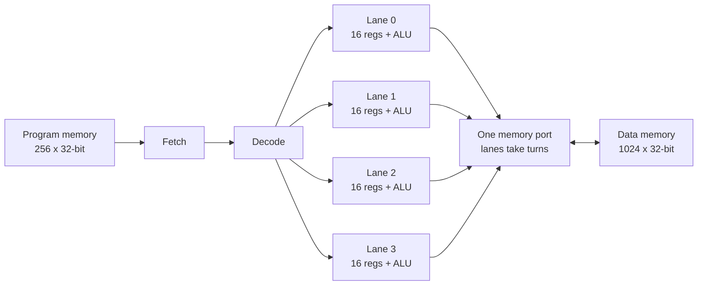

# gpu-from-scratch

**ForgeGPU** is a tiny GPU written from scratch in Verilog. It's small enough to read in an
afternoon, and you can watch it do the math. It ships with:

- **The hardware:** a 4-lane SIMT core (`hw/gpu.v`, ~200 lines)
- **An assembler** for its instruction set (`tools/asm.py`)
- **A Python reference model** (`tools/refsim.py`). The hardware is checked against it on
  *every* register write, load, store and branch, plus the cycle count.
- **Five kernels:** vector add, matrix multiply, a neural-network layer, FORGE's mesh-volume
  math, and a deliberate branch-divergence failure
- **A step-through viewer** (`--html`): pick a kernel, press Play, and watch each instruction
  hit all four lanes at once

The design is original, written for this repo. It borrows ideas, not code, from the
open-source GPUs listed in [Prior art](#prior-art).

## Quick start

```bash
sudo apt-get install iverilog        # macOS: brew install icarus-verilog
python tools/run.py --all            # assemble + simulate every kernel, check the answers
python tools/run.py matmul --trace   # print every instruction and what each lane did
python tools/run.py --all --html build/viewer.html   # then open build/viewer.html
python -m pytest -q                  # 18 tests
```

The only dependencies are Python 3.10+ and Icarus Verilog. `--backend ref` runs without
Verilog.

Sample output:

```
=== matmul: Matrix multiply: C = A x B (4x4)
    4 block(s) x 4 lanes = 16 threads, 19 instructions in the program
    196 instructions issued, 560 ALU lane-operations, 536 cycles (144 of them waiting on the memory port)
    hardware matched the reference model on every register write, load, store and branch
    PASS: C =
    [9, 2, 3, 2]
    [21, 6, 7, 10]
    ...
```

---

## How a GPU does math

A CPU core is built to run **one** thread fast. A GPU is built to run **thousands** of threads
that all do the same thing to different data, like every pixel, every matrix element, or every
triangle. Five ideas cover most of it, and each one maps to something you can see in this repo.

### 1. One instruction, many lanes (SIMT)

GPUs group threads into *warps* (NVIDIA, 32 threads) or *wavefronts* (AMD, 32–64). All threads
in the group execute the same instruction in lockstep, each on its own registers. Fetching and
decoding the instruction is paid once and shared by every lane, so adding lanes adds arithmetic
almost for free. [[1]](#sources)

**In ForgeGPU:** `hw/gpu.v`, state `S_EXEC`: a `for` loop over `NLANES` computes every lane's
result in the same clock cycle. In the viewer, every `mul` lights up four registers at once,
one per lane color.

### 2. Same code, different data: thread IDs

Each thread reads its own ID (`threadIdx`, `blockIdx`) and uses it to choose which element it
handles. That's how one program covers a whole array.

```asm
sreg r0, blockIdx
sreg r1, blockDim
sreg r2, threadIdx
mul  r3, r0, r1
add  r3, r3, r2        # i = blockIdx * blockDim + threadIdx  — different in every lane
ld   r4, 0(r3)         # so every lane loads a different element
```

### 3. Memory is the real bottleneck

The math is cheap and moving data is expensive. ForgeGPU has **one** memory port, so a load
costs 4 cycles: each lane takes its turn. Across the kernels, 27–38% of all cycles go to
waiting on memory:

| kernel | threads | instructions | ALU lane-ops | cycles | cycles waiting on memory |
|---|---|---|---|---|---|
| vector_add | 8 | 20 | 48 | 64 | 24 (38%) |
| relu_layer | 4 | 47 | 128 | 134 | 40 (30%) |
| mesh_volume | 12 | 96 | 252 | 312 | 120 (38%) |
| matmul (4×4) | 16 | 196 | 560 | 536 | 144 (27%) |

Real GPUs fight this with three techniques. **Coalescing** merges 32 neighboring addresses
into one wide transaction. **Shared memory** is a small on-chip scratchpad, so a matrix tile is
loaded once and reused many times; tiled matmul exists because of it. **Caches** handle the
rest. These are roadmap phases 2 and 4.

### 4. Branches and divergence

If lanes disagree on a branch, the warp can't go two ways at once. GPUs serialize: they run
path A with some lanes masked off, then path B, then *reconverge*. The hardware tracks this
with an execution mask and a **reconvergence stack**, and reconverges at the branch's
immediate post-dominator. [[1]](#sources) [[2]](#sources)

**In ForgeGPU:** there's no mask yet. `kernels/divergence_demo.asm` triggers divergence on
purpose, and the core stops with `error=1`. Every other kernel loops uniformly (every lane
runs the same trip count), which is why matmul works. Adding the mask and stack is roadmap
phase 2.

### 5. Number formats: integers, fixed point, floating point

| format | what it is | hardware cost | used for |
|---|---|---|---|
| **int32** | what ForgeGPU has today | adder + multiplier | indices, counters, exact geometry |
| **fixed point** (e.g. Q8.8) | integer with an implied binary point: 1.5 is stored as 384 | same as int, plus a shift | DSP, embedded ML, and FPGAs, where it's fast and small [[3]](#sources) |
| **FP32 / FP16 / BF16** | IEEE-754 sign · exponent · mantissa | much larger: align exponents, add, normalize, round | graphics, training, scientific work |
| **FMA** | `a*b + c` with a single rounding | one unit doing two jobs | the core operation of every matrix multiply |

The trade-off: fixed point is fast and small, but you must know your number range ahead of
time. Floating point handles any range but costs far more logic. [[3]](#sources)
`kernels/relu_layer.asm` runs a neural-network layer in Q8.8. Multiplying two Q8.8 numbers
gives a Q16.16 result, so `sra r, r, 8` rescales it. The output matches float math for these
inputs, and the check prints both side by side.

### 6. Matrix units (tensor cores, systolic arrays)

Modern AI chips add a dedicated matrix unit: a grid of multiply-accumulate cells where one
matrix stays in place and the other streams through, with partial sums handed from cell to
neighbor every clock. [[4]](#sources) A 4×4 grid does 16 multiply-adds per cycle. ForgeGPU
needs two instructions (`mul`, then `add`) at 2 cycles each to do 4 multiply-adds, which is
1 per cycle, before counting the loads. That 16× gap is why matrix units exist (roadmap
phase 5).

---

## Architecture



The core is multi-cycle: FETCH (1 cycle), then EXEC (1 cycle, all lanes in parallel), then for
loads and stores, MEM (1 cycle per lane). A kernel launches over `grid` blocks of 4 threads.
Blocks run one after another, and each block starts with fresh registers.

### Instruction set

32-bit instructions with 16 signed 32-bit registers per lane. Defined once in `tools/isa.py`;
`hw/isa.vh` must match it, and a test enforces that.

| instruction | meaning |
|---|---|
| `li rd, imm` | rd = imm (18-bit signed) |
| `add / sub / mul rd, rs, rt` | rd = rs op rt (mul keeps the low 32 bits) |
| `addi rd, rs, imm` | rd = rs + imm |
| `sra rd, rs, imm` | arithmetic shift right (fixed-point rescale) |
| `slt rd, rs, rt` | rd = rs < rt |
| `max rd, rs, rt` | rd = max (ReLU is `max rd, rs, rZero`) |
| `ld rd, imm(rs)` / `st rd, imm(rs)` | load from / store to data memory |
| `sreg rd, threadIdx \| blockIdx \| blockDim \| gridDim` | read this thread's IDs |
| `bnz rs, label` | branch if rs ≠ 0. Must be uniform across lanes (see §4) |
| `halt` / `nop` | end this block / do nothing |

## Code that runs on it

| kernel | what it computes | why it's here |
|---|---|---|
| `vector_add` | C[i] = A[i] + B[i] | The "hello world": thread IDs and parallel loads |
| `matmul` | 4×4 C = A×B, one thread per output | Loops, multiply-accumulate, the core of all AI math |
| `relu_layer` | y = ReLU(W·x + b) in Q8.8 | One neural-network layer in fixed point |
| `mesh_volume` | 6·signed volume per triangle, summed to get solid volume | The math FORGE's BOM uses on STEP files, one triangle per thread. 10×10×10 cube → 1000 |
| `divergence_demo` | lanes disagree on a branch | Shows the limitation roadmap phase 2 removes |

To add a kernel, write `kernels/<name>.asm` plus `kernels/<name>.py` with `TITLE`, `GRID`,
`setup()` (initial memory) and `check(mem)`. The runner and tests pick it up automatically.

---

## Roadmap

Each phase ends the same way: every existing kernel still passes on hardware and the reference
model, and the viewer shows the new behavior.

| phase | goal | what we build | how we know it works |
|---|---|---|---|
| **1. Done** | A GPU that computes and that you can watch | 4-lane core, integer ISA, assembler, reference model, 5 kernels, viewer, CI | 18 tests; hardware equals reference event for event |
| **2. Control & cooperation** | Real GPU programming model | Execution mask plus reconvergence stack (divergent `if/else`); `bar` barrier; shared memory per block; `atom.add` | `divergence_demo` passes. **Parallel reduction** sums mesh volume on the GPU instead of the host |
| **3. Real numbers** | Floating point | `fma` (int and fixed point first), then FP32 add/mul/FMA units (multi-cycle), then BF16 | Bit-exact against Python/NumPy float32 on random tests, including NaN/Inf/denormals |
| **4. Throughput** | Make it fast, and measure it | Pipeline fetch/exec; wide coalesced memory port; 2–4 cores with a block dispatcher; small cache | Cycle counts in the table above drop, and each change is attributed |
| **5. Matrix unit** | A tiny "tensor core" | `mma` instruction on a 4×4 systolic tile | Same answers in a fraction of the cycles (target: under 1/8) |
| **6. Real hardware** | Run on an FPGA | Synthesize with the open toolchain (Yosys + nextpnr); UART link to load programs and read results | Same kernels, same answers, on a ~$50–150 iCE40/ECP5 board |
| **7. Silicon (optional)** | A chip with your GPU on it | Cut-down "tapeout edition" for [Tiny Tapeout](https://tinytapeout.com/) | Fabricated chip runs vector_add. ($300 per tile, ~1000 cells per tile [[5]](#sources)) |
| **8. Software** | Stop hand-writing assembly | A small compiler from a Python/C subset to this ISA, plus a host runtime (`launch(kernel, grid, buffers)`) | Kernels rewritten in the high-level language produce identical traces |

**A reality check on phase 7:** today's core holds 4 lanes × 16 registers × 32 bits = 2,048
bits of registers alone. That's far more than one Tiny Tapeout tile (~1,000 standard cells).
A tapeout edition means about 2 lanes, 8-bit data, 4 registers, and memory off-chip through
the pins, which is what other single-developer Tiny Tapeout GPUs have done. [[6]](#sources)

**Tie-in with FORGE:** STEP tessellation, mesh volume (already a kernel), the
thin-wall checks and nearest-face searches are all "same math over thousands of triangles."
They're exactly the workloads this design is shaped for. A useful milestone is running FORGE's
real BOM volume on ForgeGPU and matching OpenCASCADE's number.

## Prior art

Use these for study and comparison. They're the reason this design looks the way it does.

| project | what it is | license | notes |
|---|---|---|---|
| [tiny-gpu](https://github.com/adam-maj/tiny-gpu) | 12-file teaching GPU in SystemVerilog | **none published** | Closest in spirit. No license file, so read it, don't copy it. I ran its matmul simulation and it works (491 cycles). |
| [Vortex](https://github.com/vortexgpgpu/vortex) | RISC-V GPGPU from Georgia Tech, runs OpenCL; v3 adds graphics and Vulkan | Apache-2.0 | Real-scale reference for phases 2–4. Actively developed. |
| [Nyuzi](https://github.com/jbush001/NyuziProcessor) | GPGPU with a software 3D renderer | Apache-2.0 | Excellent docs on pipelining and caches (phase 4) |
| [MIAOW](https://github.com/VerticalResearchGroup/miaow) | AMD Southern Islands compute unit | BSD-style | How a commercial ISA maps onto hardware |
| TinyGPU v2 (Pongsagon Vichit) | Fabricated through Tiny Tapeout; real-time 3D on silicon | — | Proof that phase 7 is reachable by one person [[6]](#sources) |
| [Tiny TPU](https://www.mintlify.com/tiny-tpu-v2/tiny-tpu), Gemmini | Systolic-array ML accelerators | open | Reference for phase 5 [[4]](#sources) |

## Repository layout

```
hw/        gpu.v (the GPU), tb.v (testbench), isa.vh (opcodes)
tools/     isa.py, asm.py, refsim.py (reference model), run.py (runner), viewer.html
kernels/   *.asm programs + *.py setup/check for each
tests/     pytest suite (ISA sync, assembler, every kernel on both models)
```

## Sources

1. Warp execution, divergence and reconvergence stacks: [UCR GPU architecture notes](https://www.cs.ucr.edu/~nael/217-f19/lectures/architecture-notes1.txt); [ElTantawy et al., HPCA 2014](https://people.ece.ubc.ca/aamodt/papers/eltantawy.hpca2014.pdf)
2. [Characterizing Warp Divergence from Pascal to Blackwell](https://huggingface.co/papers/2607.23402.md)
3. Fixed vs floating point on FPGAs: [imperix TN148](https://imperix.com/doc/TN148); [FPGA floating point overview](https://dev.to/carolineee/does-fpga-have-floating-point-4j4n)
4. Systolic arrays: [SemiAnalysis glossary](https://inferencex.semianalysis.com/glossary/systolic-array); [Tiny TPU](https://www.mintlify.com/tiny-tpu-v2/tiny-tpu); [Berkeley EE290 Gemmini lab](https://inst.eecs.berkeley.edu/%7Eee290-2/sp20/assets/labs/lab2.pdf)
5. [Tiny Tapeout](https://tinytapeout.com/), with pricing via [Efabless](https://efabless.com/tinytapeout)
6. [TinyGPU v2.0 brings 3D graphics to silicon](https://www.opensourceforu.com/2026/08/tinygpu-v2-0-brings-3d-graphics-to-silicon/)
7. Open GPU projects overview: [Vortex (Phoronix)](https://www.phoronix.com/news/Vortex-RISC-V-GPGPU), [MIAOW](https://miaowgpu.org/)
